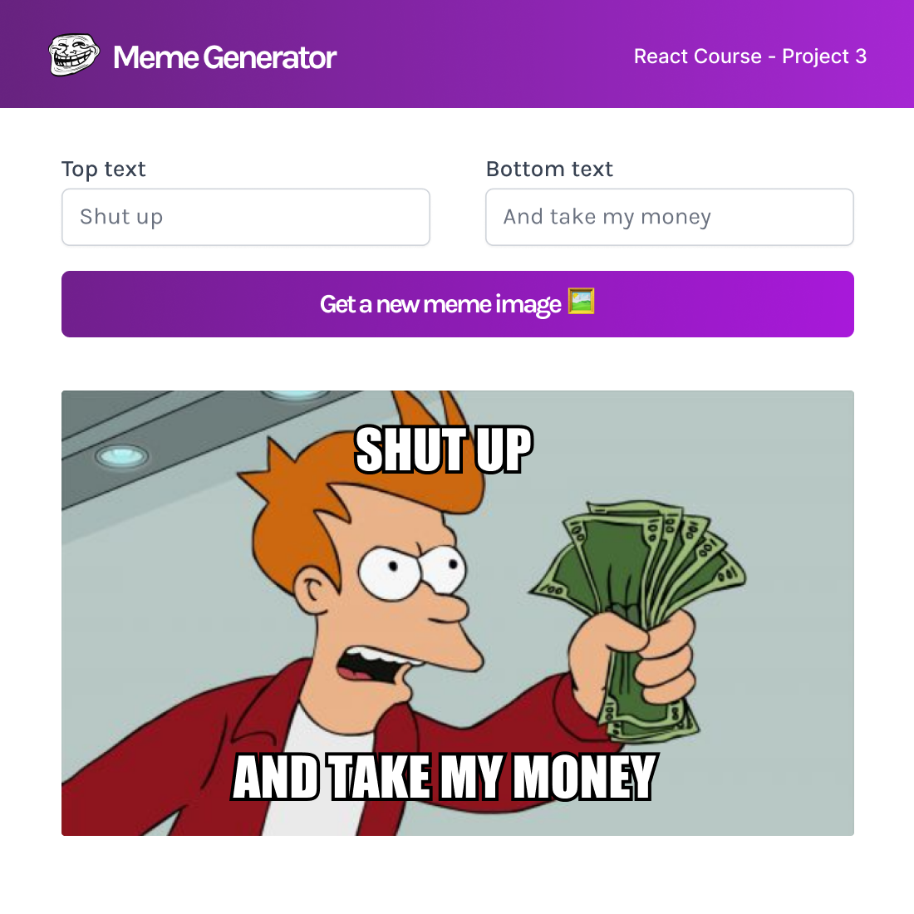

# Meme-Generator

### Challenge: Dynamic Web App

**Features**
- Event Listeners, Dynamic Styles, and Conditional Rendering
- Props vs. State
- Maintaining component state using `useState()` hook
    - Passing state as props
    - Setting state from child components
- React Forms - Controlled Inputs, Forms State Object, Handling Form Submission
- Making API calls and use of `useEffect()` hook
    - useEffect for fetching data
    - dependencies array
    - useEffect cleanup

**App Design**

Design the two components as given in the figma design below - 

  